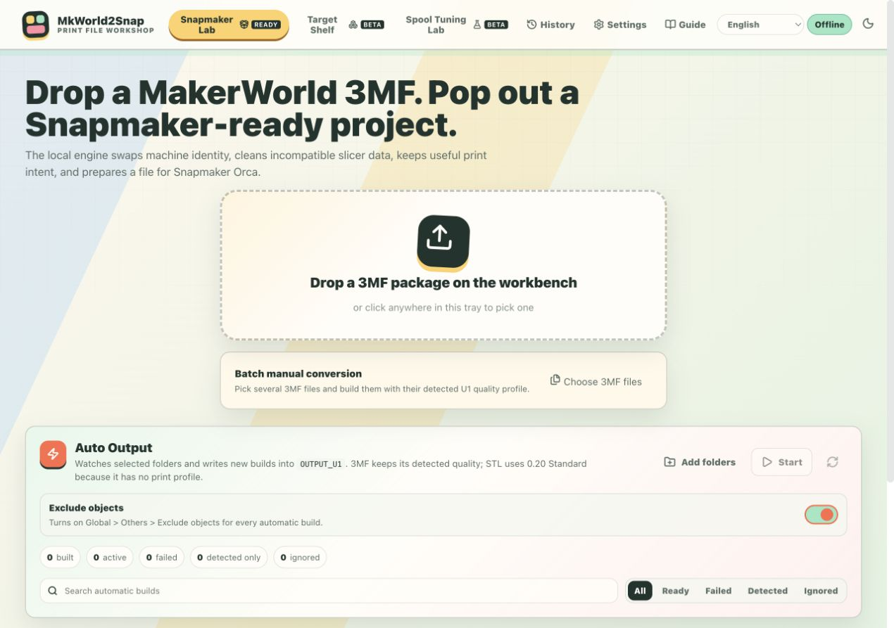
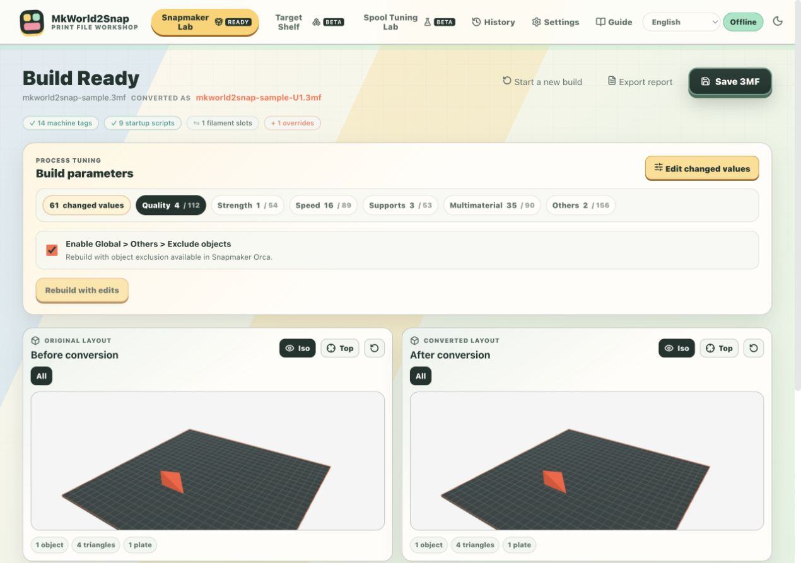
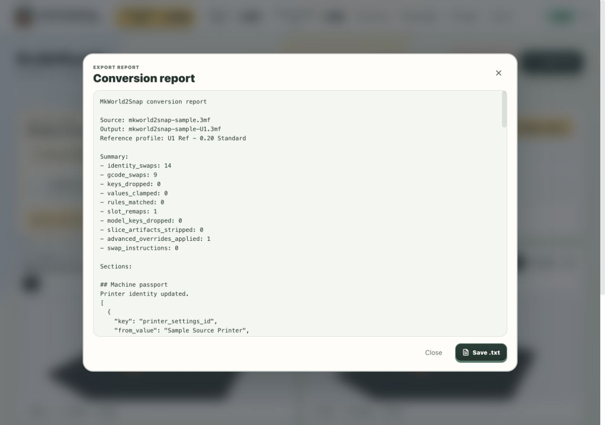
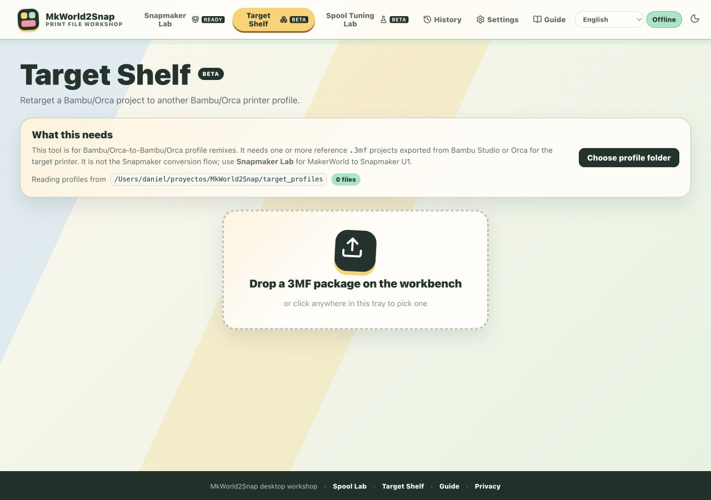
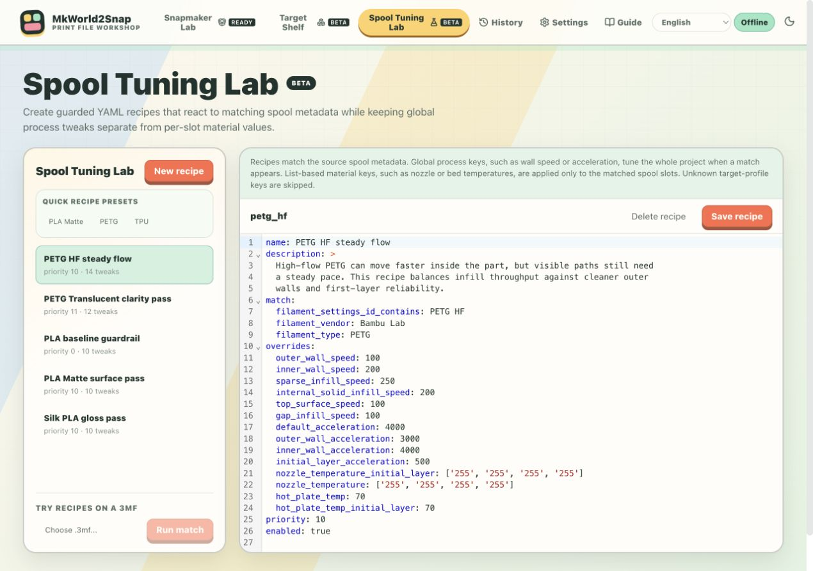
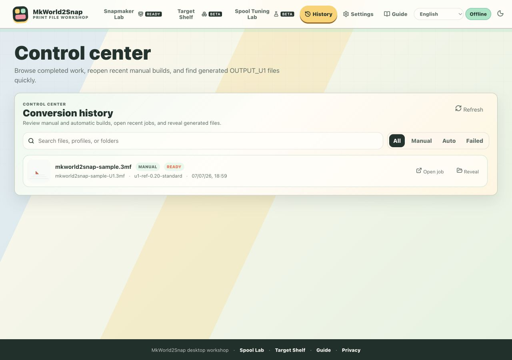
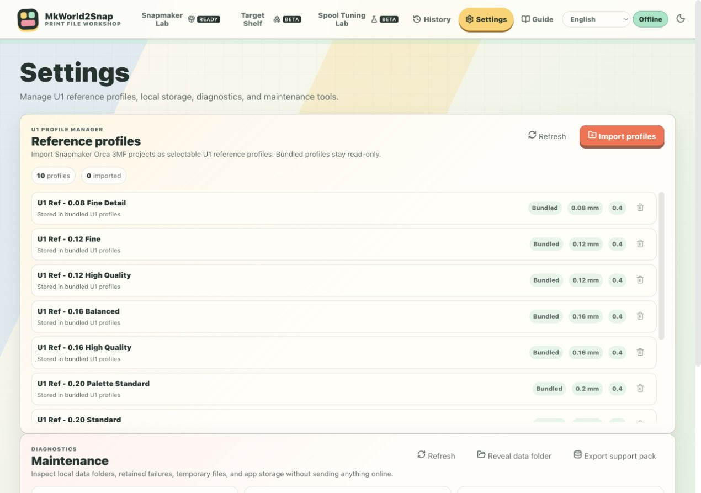
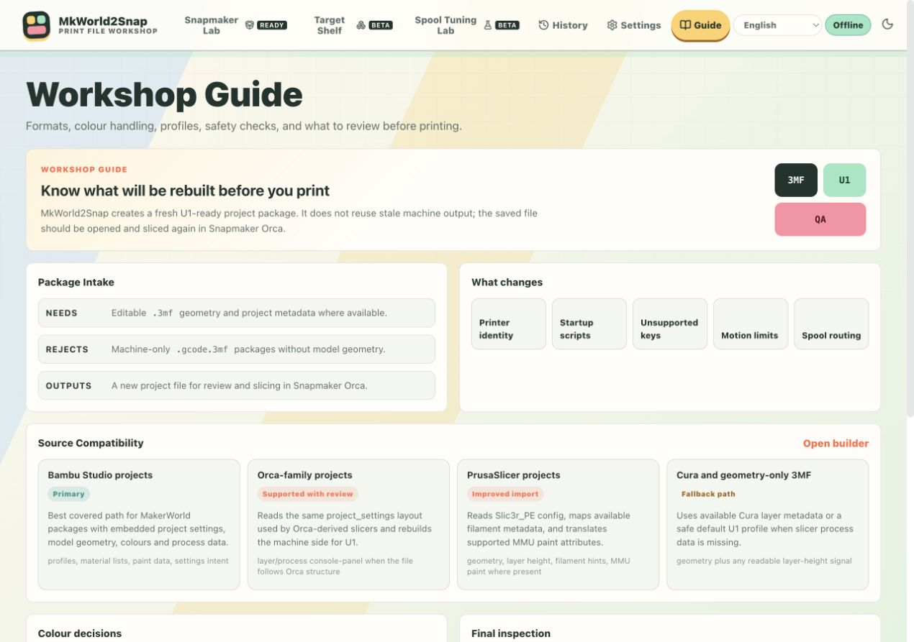

<p align="center">LAST MkWorld2Snap Release </p>

<p align="center">
  <a href="https://github.com/Dakros66/MkWorld2Snap/releases/latest">
    
  </a>
</p>


# MkWorld2Snap

MkWorld2Snap is a local desktop workshop for rebuilding downloaded slicer
project files into Snapmaker U1-ready `.3mf` packages for Snapmaker Orca.

It focuses on editable project archives, not pre-sliced machine output. The app
retargets printer identity, startup scripts, process settings, filament slots,
plate placement metadata, and safety-sensitive values while keeping useful
print intent available for review before slicing.



## What It Does

- Rebuilds editable `.3mf` projects for Snapmaker U1.
- Selects the closest bundled U1 reference profile from detected layer height.
- Preserves model geometry, plate layout, filament colours, material intent,
  and compatible painted-colour metadata where possible.
- Replaces machine identity, custom machine scripts, printable area, nozzle
  metadata, and U1 profile keys.
- Removes stale sliced caches such as embedded `plate_*.gcode` artifacts.
- Clamps known speed and acceleration ceilings against the selected U1 profile.
- Lets you review changed slicer parameters, restore U1 defaults, or apply
  explicit custom overrides.
- Adds optional `Global > Others > Exclude objects` support to manual and
  automatic builds.
- Provides automatic watched-folder conversion into `OUTPUT_U1`.
- Includes a local material tuning lab for repeatable spool-specific recipes.
- Includes a Target Shelf beta tool for same-family profile retargeting tests.
- Runs locally. No analytics, telemetry, cloud uploads, or remote account are
  required.

## Screenshots

### Manual Intake And Automatic Output

Drag a project into the workbench, batch-select multiple 3MF files, or watch
folders for new files that should be rebuilt automatically.


### Build Review

Every successful build opens a review page with conversion badges, editable
parameter groups, before/after 3D previews, and save actions.



### Conversion Report Popup

The report can be inspected in-app before saving it as a text file.



### Target Shelf

Target Shelf is an advanced beta workspace for retargeting a project to another
compatible local reference profile.



### Spool Tuning Lab

Create YAML recipes that match spool metadata and apply validated process
tweaks only when the selected U1 profile supports the affected keys.



### History

Manual and automatic builds are kept in a local history view so recent outputs
can be reopened or revealed quickly.



### Settings And Maintenance

Manage imported U1 reference profiles, inspect local storage, export support
packs, and clear history or temporary working files.



### Guide

The built-in guide summarizes supported formats, colour handling, safety checks,
and final review steps.



## Supported Inputs

| Input | Status | Notes |
|---|---|---|
| Editable 3MF project from common Orca-family slicers | Primary path | Best results when project settings and model geometry are present. |
| MakerWorld-style `.3mf` downloads | Primary path | Intended for downloaded projects that need a Snapmaker U1 rebuild. |
| PrusaSlicer `.3mf` project | Best effort | Reads common Slic3r project metadata and translates supported MMU paint attributes. |
| Cura `.3mf` project | Best effort | Reads available Cura configuration values such as layer height, material, temperatures, bed temperature, and nozzle size. |
| Geometry-only `.3mf` | Fallback | Uses the bundled `U1 Ref - 0.20 Standard` profile when no process profile is present. |
| `.stl` in Auto Output | Fallback | Automatic folder conversion can rebuild STL files with `U1 Ref - 0.20 Standard`. |
| Pre-sliced `.gcode.3mf` only | Not supported | The app needs editable model geometry and project metadata. |

## Main Workflow

1. Open MkWorld2Snap.
2. Drop an editable `.3mf` package into the Snapmaker Lab workspace.
3. Review the detected profile, preflight notes, filament slots, and 3D intake
   preview.
4. Choose build options:
   - U1 reference profile.
   - Material recipes on/off.
   - Spool-swap pause notes on/off.
   - Object exclusion on/off.
   - Optional advanced YAML overrides.
5. Build the Snapmaker file.
6. Review the Build Ready screen.
7. Inspect changed parameters, report sections, and before/after placement.
8. Save the output `.3mf` to any filename and folder.
9. Open the saved file in Snapmaker Orca and slice it there.

## Build Ready Parameter Editor

The parameter editor groups slicer settings into:

- Quality
- Strength
- Speed
- Supports
- Multimaterial
- Others

By default it shows only parameters that differ from the selected U1 reference.
For each editable key you can:

- keep the current rebuilt value,
- restore the U1 reference value,
- set a custom value when the backend can validate the key safely.

Known speed and acceleration keys are clamped again after manual overrides when
safety clamps are enabled.

## Automatic Folder Conversion

Auto Output watches selected folders and writes rebuilt files into an
`OUTPUT_U1` subfolder next to the source file.

Behaviour:

- New `.3mf` files keep their detected quality profile.
- New `.stl` files use `U1 Ref - 0.20 Standard`.
- Already processed files are skipped.
- Failed, ignored, detected-only, and completed items are visible in the UI.
- Object exclusion can be enabled globally for automatic builds.
- On supported desktop platforms, MkWorld2Snap can be configured to start after
  login.

## Spool Tuning Recipes

Recipes live in `rules/` as YAML files. They match source spool metadata and
apply repeatable tuning values only when the target profile supports the key.

Example:

```yaml
name: PLA Silk
description: Reduce aggressive motion for glossy silk PLA.
match:
  filament_settings_id_contains: Silk
  filament_type: PLA
overrides:
  outer_wall_speed: 80
  inner_wall_speed: 120
  default_acceleration: 3000
priority: 10
enabled: true
```

Global process keys, such as speed and acceleration, tune the project when a
recipe matches. List-based material keys, such as nozzle or bed temperatures,
are applied only to matching spool slots.

## Target Shelf Beta

Target Shelf is for advanced profile retargeting tests. It needs a local folder
containing compatible `.3mf` reference profiles exported for the desired target
printer/profile.

It is separate from the main Snapmaker U1 rebuild flow. Use it when you have a
known-good reference shelf and want to retarget a project against that shelf.

## Local Data And Privacy

MkWorld2Snap stores runtime data locally:

- macOS: `~/Library/Application Support/MkWorld2Snap`
- Windows: `%APPDATA%/MkWorld2Snap`
- Linux: `${XDG_DATA_HOME:-~/.local/share}/MkWorld2Snap`

Stored data may include:

- settings,
- watched folder paths,
- conversion history,
- imported U1 reference profiles,
- imported recipe files,
- temporary build folders,
- retained failure diagnostics when enabled.

The app does not upload models, profiles, logs, or usage data. The privacy page
is available at `frontend/public/privacy.html` and in packaged/web builds.

## Run The Desktop App

Create or activate the Python environment, install dependencies, build the
frontend once, and launch the desktop window:

```bash
cd MkWorld2Snap
/usr/local/bin/python3 -m venv .venv
.venv/bin/python -m pip install -r backend/requirements.txt -r requirements-desktop.txt
cd frontend
pnpm install
pnpm run build
cd ..
.venv/bin/python desktop_app.py
```

The desktop launcher starts the local API engine and opens MkWorld2Snap in its
own native window.

## Development

Backend:

```bash
cd MkWorld2Snap
env \
  PYTHONPATH=backend \
  MKWORLD2SNAP_APP_ROOT="$PWD" \
  MKWORLD2SNAP_PROFILES="$PWD/profiles" \
  MKWORLD2SNAP_USER_PROFILES="$PWD/user_profiles" \
  MKWORLD2SNAP_TARGET_PROFILES="$PWD/target_profiles" \
  MKWORLD2SNAP_RULES="$PWD/rules" \
  MKWORLD2SNAP_TMP="$PWD/tmp" \
  MKWORLD2SNAP_FAILED_TMP="$PWD/tmp_failed" \
  MKWORLD2SNAP_FRONTEND_DIST="$PWD/frontend/dist" \
  MKWORLD2SNAP_CONFIG="$PWD/desktop_data/settings.json" \
  .venv/bin/python -m uvicorn local_gateway:app --host 127.0.0.1 --port 8080
```

Frontend:

```bash
cd frontend
pnpm install
pnpm run dev
```

The Vite dev server proxies `/engine` requests to `http://127.0.0.1:8080`.

## Docker

```bash
docker compose up --build
```

Then open:

```text
http://localhost:8084
```

## Desktop Packaging

```bash
./scripts/build_desktop_macos.sh
open dist/MkWorld2Snap.app
```

The macOS script builds a Universal 2 app for Apple Silicon and Intel Macs. It
uses a separate `.venv-universal2` environment and writes:

```text
dist/MkWorld2Snap.app
```

Windows packaging is prepared through:

```bat
scripts\build_desktop_windows.bat
```

That script writes:

```text
dist\MkWorld2Snap.exe
```

Linux packaging is prepared through:

```bash
./scripts/build_desktop_linux.sh
```

That script writes a single executable:

```text
dist/MkWorld2Snap
```

All desktop scripts use `MkWorld2Snap.spec`, the generated frontend bundle, the
bundled U1 profiles, the recipe folder, and the app icons in `assets/`.

## GitHub Actions Builds

The repository includes a manual workflow named `Build desktop packages`.

It builds:

- `MkWorld2Snap-<version>-macOS-universal2.zip`
- `MkWorld2Snap-<version>-windows-x64.zip`
- `MkWorld2Snap-<version>-linux-x64.zip`

Run it from GitHub Actions with `create_release=false` to compile and download
artifacts only. Set `create_release=true` when you want the workflow to create
or update release `v<version>` with the generated assets and `SHA256SUMS.txt`.

The workflow also runs a public-source guard that fails if generated desktop
artifacts or local machine paths are accidentally committed.

## Project Layout

```text
backend/
  local_gateway.py              Local API, job registry, diagnostics, desktop helpers
  u1_packager.py                3MF unpack, transform, validation, and repack pipeline
  reference_catalog.py          Reference profile discovery and project settings reads
  parameter_guardrails.py       Schema filtering and speed/acceleration clamping
  machine_script_library.py     Machine script replacement
  spool_tuning.py               YAML recipe loading, matching, and application
  pause_planner.py              Spool-swap pause planning
  scene_metadata.py             Archive/XML/project metadata helpers
  scene_preview.py              Lightweight 3D scene extraction
  activity_report.py            Structured build report assembly
  static_security.py            Local static security headers

frontend/src/
  Shell.svelte                  Main application shell and routing
  theme.css                     Global visual system
  lib/IntakeDeck.svelte         Manual intake panel
  lib/BuildConsole.svelte       U1 profile and build controls
  lib/ArtifactReview.svelte     Build Ready review, save, report, and parameters
  lib/ScenePreview.svelte       3D project preview
  lib/FolderWatchPanel.svelte   Automatic folder conversion
  lib/FilamentStudio.svelte     Filament routing and checklist
  lib/TargetShelfLab.svelte     Target Shelf beta
  lib/SpoolTuningLab.svelte     YAML recipe editor/tester
  lib/ConversionHistory.svelte  Local conversion history
  lib/ProfileManager.svelte     Imported U1 profile manager
  lib/MaintenancePanel.svelte   Diagnostics and maintenance
  lib/FieldManual.svelte        Built-in guide
  lib/engineClient.ts           Typed frontend API client

profiles/        Bundled Snapmaker U1 reference packages
rules/           Seed material tuning recipes
target_profiles/ Optional local Target Shelf references
user_profiles/   Optional imported U1 reference profiles
docs/            Documentation and screenshots
tests/           Format and conversion tests
```

## Validation

Recommended checks before publishing:

```bash
PYTHONPATH=backend .venv/bin/python -m pytest tests
.venv/bin/python -m compileall backend desktop_app.py
cd frontend
pnpm run check
pnpm run build
```

## Current Limits

- Snapmaker U1 is the primary target.
- Output packages must be opened and sliced again in Snapmaker Orca.
- Plate placement is rebuilt conservatively, but large or unusual layouts still
  need visual review before slicing.
- Painted geometry is preserved for Orca to resolve while slicing; manual pause
  notes cannot be precomputed for all painted-colour cases.
- Non-main-path slicer formats are best effort and should be checked carefully.

## License

MkWorld2Snap is licensed under the PolyForm Noncommercial License 1.0.0. See
[LICENSE](LICENSE). Additional attribution and upstream notices are listed in
[NOTICE.md](NOTICE.md).
